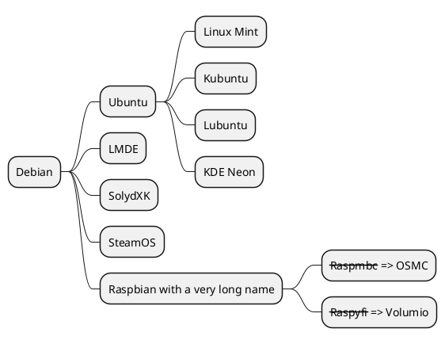

# Hello Markdown!


## Markdown Heading for All Documents

Well formatted documentation is a good thing!  While you can build some very nicely formatted documents with Latex or Docbook, Markdown is faster and easier, and looks very good.


---


### Subheading
#### Subsub heading
##### even littler heading

<!-- Italics -->
*This text is italic*

_This is also an italic_
This is **an emphasised** word.


Were going to ~~strike this out~~

---
or triple underscores
___


> The other guys said this
> ti=o me

[Link title](http://www.surrealistic.org)

* paper
* coffee
* cheese
  * swiss
  * cheddar
  * helveta

1. Camels
2. Dogs
3. Fish
4. Chickens

```bash
#!/bin/bash

echo Hello
echo World

exit 99
```

| Name      |   Nickname    |
| --------- |  ----------
| Scott     |  Sparky       |
| Nick      |  Nickname     |
| Scotto    |  scott@surrealisit.org | 


# My Header


## Tasklists

* [x] Go Shopping
* [x] Buy cheese
* [ ] Clean the house




