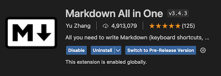
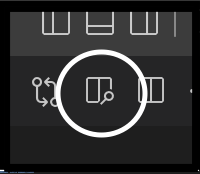
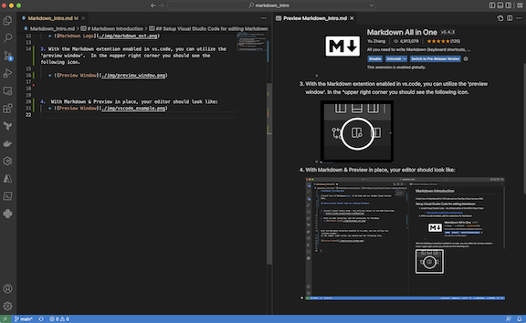

# Markdown Introduction

A brief tour of Markdown&copy; in VS.Code and our DevOps Cloud Journey Wiki.

## What is Markdown

Tool for generating formatted html from markdown formatted text.


## Killer App 
The 'killer app' for Markdown is its ability to nicely display Code Samples

Maybe you want to document running `terraform plan` before you run `terraform apply`. 

Maybe you want to write a note about something unexpected that happens in a bash script:

``` bash
#!/bin/bash

for a in *flac
do
       OUTF=`echo "$a" | sed s/\.flac/.mp3/g`
       ARTIST=`metaflac "$a" --show-tag=ARTIST | sed s/.*=//g`
       TITLE=`metaflac "$a" --show-tag=TITLE | sed s/.*=//g`
       ALBUM=`metaflac "$a" --show-tag=ALBUM | sed s/.*=//g`
       GENRE=`metaflac "$a" --show-tag=GENRE | sed s/.*=//g`
       TRACKNUMBER=`metaflac "$a" --show-tag=TRACKNUMBER | sed s/.*=//g`

       flac -c -d "$a" | lame -m j -b 192 -s 44.1 - "$OUTF"
       id3v2 -t "$TITLE" -T "$TRACKNUMBER" -a "$ARTIST" -A "$ALBUM" -g "$GENRE" "$OUTF"
done
```

Code intrepreters exist for common languages, I found the perl syntax highlighter works well for HCL.  

``` perl 
# Configure the Azure provider
terraform {
  required_providers {
    azurerm = {
      source  = "hashicorp/azurerm"
      version = "~> 2.65"
    }
  }

  required_version = ">= 0.14.9"
}

provider "azurerm" {
  features {}
}
```


---


## Setup Visual Studio Code for editing Markdown


1. Install Visual Studio Code - the official editor of the MHS-Cloud-Team
   * https://code.visualstudio.com/Download
  
2. With vs.code installed, add the extensions for Markdown
   * 

3. With the Markdown extention enabled in vs.code, you can utilize the 'preview window'.  In the *upper right corner you should see the following icon.

   * 


4.  With Markdown & Preview in place, your editor should look like:
   * 


## Markdown Syntax
Markdown has a very simple syntax; many of its markup elements appear to be borrowed from the ways people currently use to apply emphasis or meaning in other plaintext format communications. 

For example, adding *italic emphasis* to a word **or boldness** or the extreme ***italisised boldness*** to a word. 

---


---

# Markdown Cheat Sheet

Thanks for visiting [The Markdown Guide](https://www.markdownguide.org)!

This Markdown cheat sheet provides a quick overview of all the Markdown syntax elements. It can’t cover every edge case, so if you need more information about any of these elements, refer to the reference guides for [basic syntax](https://www.markdownguide.org/basic-syntax) and [extended syntax](https://www.markdownguide.org/extended-syntax).

## Basic Syntax

These are the elements outlined in John Gruber’s original design document. All Markdown applications support these elements.

### Heading

# H1
## H2
### H3

### Bold

**bold text**

### Italic

*italicized text*

### Blockquote

> blockquote

### Ordered List

1. First item
2. Second item
3. Third item

### Unordered List

- First item
- Second item
- Third item

### Code

`code`

### Horizontal Rule

---

### Link

[Markdown Guide](https://www.markdownguide.org)

### Image


## Extended Syntax

These elements extend the basic syntax by adding additional features. Not all Markdown applications support these elements.

### Table

| Syntax | Description |
| ----------- | ----------- |
| Header | Title |
| Paragraph | Text |

### Fenced Code Block

```
{
  "firstName": "John",
  "lastName": "Smith",
  "age": 25
}
```

### Footnote

Here's a sentence with a footnote. [^1]

[^1]: This is the footnote.

### Heading ID

### My Great Heading {#custom-id}

### Definition List

term
: definition

### Strikethrough

~~The world is flat.~~

### Task List

- [x] Write the press release
- [ ] Update the website
- [ ] Contact the media

### Emoji

That is so funny! :joy:

(See also [Copying and Pasting Emoji](https://www.markdownguide.org/extended-syntax/#copying-and-pasting-emoji))

### Highlight

I need to highlight these ==very important words==.

### Subscript

H~2~O

### Superscript

X^2^